# Week_18_Assignment

# Creating a BlockChain in Ethereum using Proof of Authority

## Creating the Genesis Block

In the GitBash/Terminal window navigate to the necessary files which are located in local folder:
C:\Users\DavidsSurfacePro\Desktop\FinTech-Boothcamp\Homeworks\Week_18_Assignment\Blockchain-Tools

The program Puppeth, located in that folder will be used to generate the Genesis Block and to set up the parameters for the Proof of Austhprity chain.
 
In the terminal, type

* ./puppeth

The following (image 1) will be displayed and a request to create a network name

The network name is:

> david18net

Once the network is named there are a series of questions to configure the network. Following the prompts, respond with
* 2 Configure New Genesis
* 1 Create new genesis from scratch
* 2 Clique - proof of authority
* 15 deafult for seconds the block should take

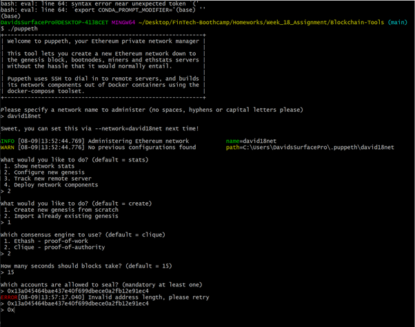

Then to set up accounts to seal and fund, use the Public Key from the My Crypto account.
Then fund the account with 1 wei. with a netwrok ID of 999

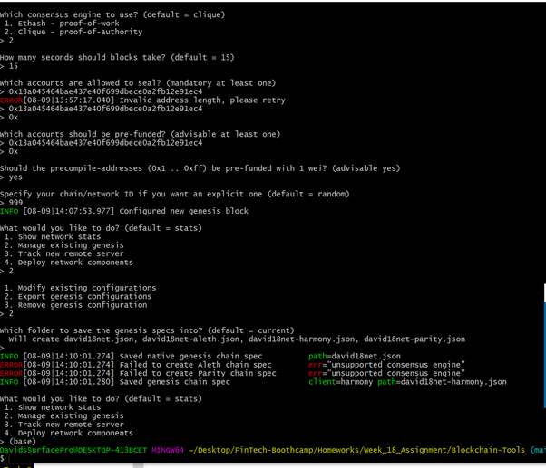

You will then receive confirmation that the genesis has been configured. 
Export the genesis as a json file to the local drive by clicking on 2 Manage Existing genesis and 2 Export genesis configuration.
Save to the default folder which is the one you are working in.

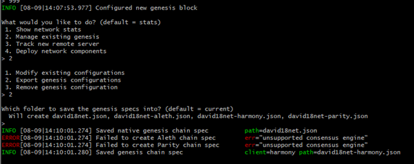

## Creating Two Nodes

Remaining in the Blaockchain-Tools folder create 2 nodes using the following codes

* ./geth account new --datadir node1
* ./geth account new --datadir node2

You will be prompted to add a password when creating each nodes. Keeping the same password.

The process is shown in images 5-7 where the password has been deleted.
Private and secrey keys are produced duirng this operation for both Nodes. The secret keys can be located in the 
working folder and keystore file for each Node (see image 8). Note the public key for later use.

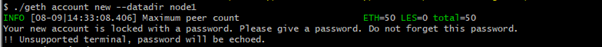
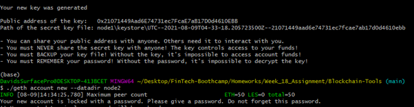
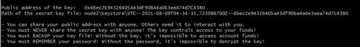
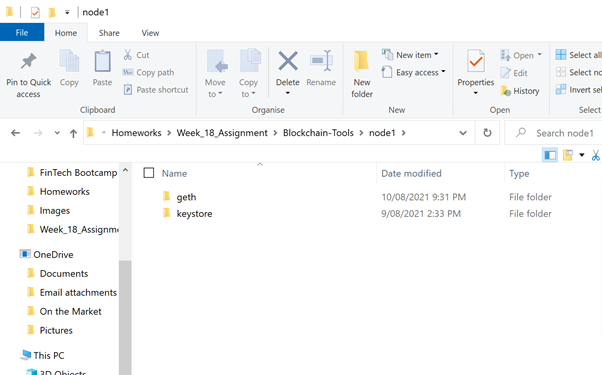

## Initiating the Nodes

Using the the genesis block/json files generated earlier, initialise both nodes with the following commands 

* ./geth init david18net.json --datadir node1
* ./geth init david18net.json --datadir node2

Is successfully generated you will receive the reponse 
* "Successfully wrote genesis state"

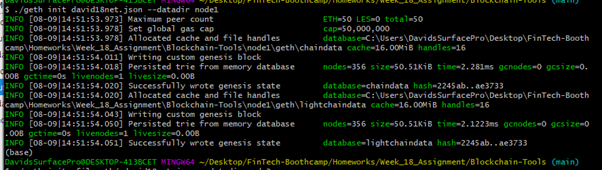

## Launching the Blockchain

Remain in the Blockchain-Tools folder on your Terminal window

Using the Proof of Authprity blockchain requires the passwords to be unlocked for both Nodes:

Using the geth command the Blockchain mining is launched by the following commands, done in separate terminal windows.
Firstly for Node 1 using the Public address key
* ./geth --datadir node1 --unlock "0x21071449Aad6E74731ec7FcaE7aB17D0d4610EBB" --mine --rpc --allow-insecure-unlock

An image of the launch is shown in image 10 below. Also in this image the enode, used to launch Node 2, is shown on the row titled " Started P2P networking"

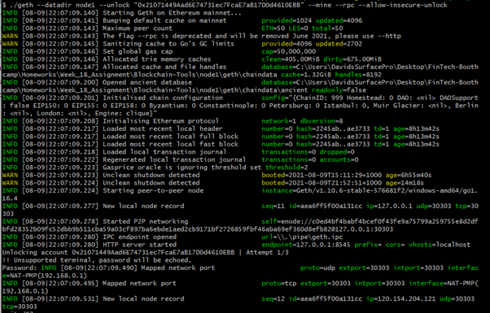

Then to launch node two using its 

* ./geth --datadir node2 --unlock "0x6Bec2E94326405A43dF90BA4a0E3eeA74d7C4380"  --mine --port 30304 --bootnodes "enode://c0ed4bf4babf4bcef0f43fe9a75799a259755e8d2dfbfd28352b09fc52dbb9b511cba59a03cf897ba6ebde1aed2cb9171bf2726859fbf46aba69ef360d8efb82@127.0.0.1:30303" --ipcdisable --allow-insecure-unlock

# Unfortunately, after "numerous" attempts at adjusting code,  reinitiaiting and trying variants of entering or not entering the password the mining process did not appear to be successful, image 11.

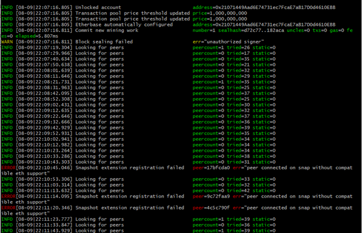

## Adding the Blockchain to the MyCrypto Exchange

Open MyCrypto site and click on bottme left "Change Network" , then click on "Add Custom Node".

Add david18.net as Network and Node name, scroll to Custom on the Network dropfo=down menu and add http://127.0.01:845 as the URL.

Click on "Save and Use Custom Node" to create the custom node david18net in MyCrypto

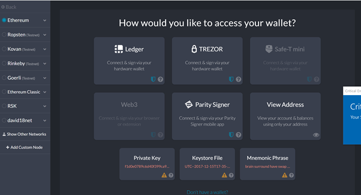

Then back to change network where david18net will now exist.
Click on the new wallet/network "david18.net" on bottom left, and then select "View & Send".

Enter the Wallet by clicking on "Keystore File" and select wallet.

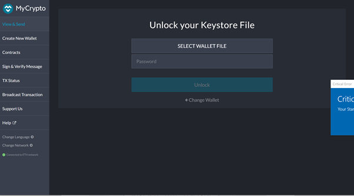

The  wallet file is located in the Keystore folder of Node1 the local drive (image 14).
Enter the password used in creating the Node and click "Unlock" to enter the wallet.

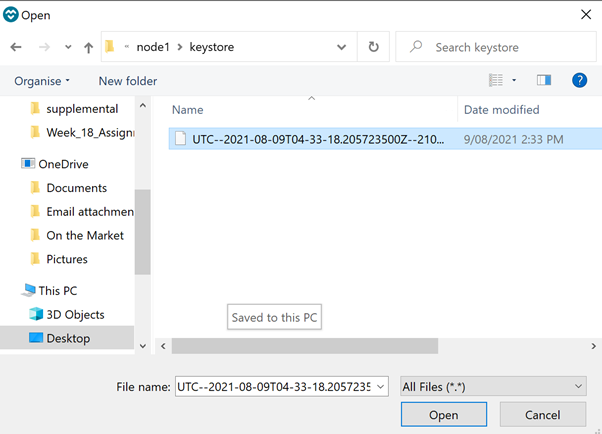
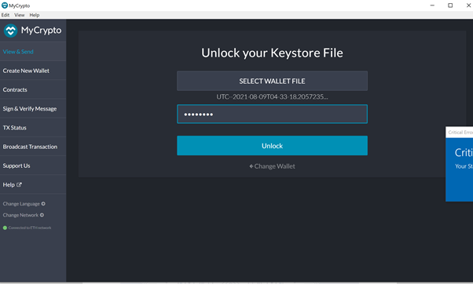

The balance of Ehereum, which should be a lot (but isn’t) on the right hand side.

# However, note that the bal;ance of the Node 1 account is 0 ETH. (image 16). and as a consequence it was not possible to transfer funds
# from the account. It is uncertain why the private blockchain was not cfreated successfully but after much probelm solving I was unsuccessful in resolving. 
# One observation is that the 1wei was deposited into Node1 using the  MyCrypto account Address as the Key for Node 1 was actually created after the deposit.
# In the david18net wallet the address is that of Node 1.

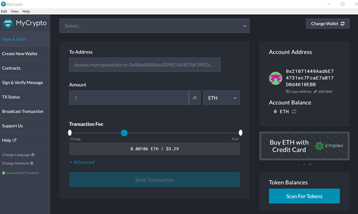
